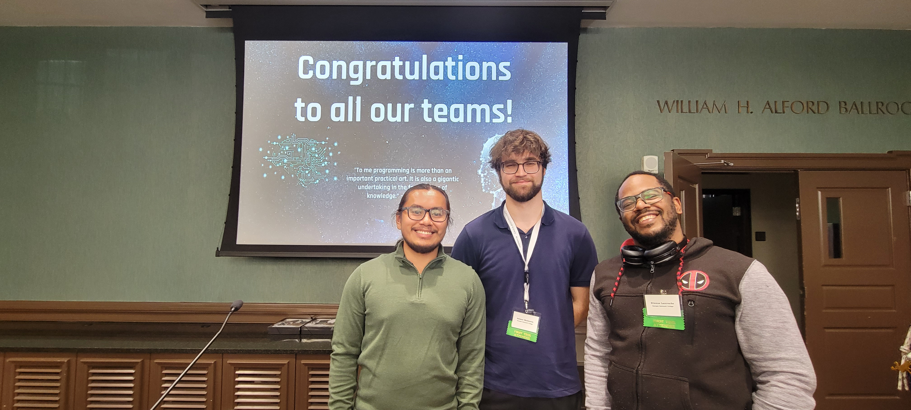

#  Teaching Algorithms and Growing STEM with Sphero
## Description
* Difficulty Level: Medium
* Target Audience: 6th Grade - College
* Duration of workshop: 60-90 minutes
* Needed Material: A classroom set of Spheros, Sphero EDU app,Sphero EDU website teacher account, a 36 in. x 48 in. foldable foam board, and a 36 in. x 48 in. plywood
* The primary goal of this project is educating others about algorithms by programming a robot through a maze using Sphero EDU. 
* Sphero is a small robot ball that moves around by either remote control or code you feed it. 
This workshop is geared towards educating and creating interest in the IT field for non STEM majors. 
By engaging in our workshops, students will get to experiment with Sphero.edu and block coding, which allows them to learn about algorithms through relatable examples. 
* The Technology Ambassador Program ([TAP](https://www.ggc.edu/academics/school-of-science-and-technology/research-internships-service-learning/technology-ambassador-program)) at GGC strives to break the misconceptions of the IT field by providing fun workshops for students of all backgrounds. TAP students design engaging and fun outreach workshops to encourage interest in IT and STEM. 

## Team
* Ammar Mehicevic
* Etienne Laccruche
* Tony Lam
### Advisors
* Dr. Cindy Robertson
* Dr. Anca Doloc-Mihu

(Left: Tony Lam, Middle: Ammar Mehicevic, Right: Etienne Laccruche)  

## Publications
1. Tony Lam, Ammar Mehicevic, Etienne Laccruche, Anca Doloc-Mihu, Cindy Robertson. Teaching Algorithms and Growing STEM with Sphero, Consortium for Computing
Sciences in Colleges: Southeastern Region (CCSC:SE), November 3-4, 2023, Conway, SC.
2. Tony Lam, Ammar Mehicevic, Etienne Laccruche, Anca Doloc-Mihu, Cindy Robertson. Teaching Algorithms and Growing STEM with Sphero, CREATE Symposium, November 30, 2023, Georgia Gwinnett College.

## Outreach Activities
1. Tap Expo, Oct 10, GGC – To promote IT field and the TAP program to college students
2. Super Saturday Series (S3), Nov 9, GGC – middle and high school girls to promote IT and
STEM career
3. Class Workshops – October 26th, November 13th, November 14th - promote IT field to non-IT college
students
##Similar Projects
## Technology
Sphero is a robotic ball that can be programmed in the Sphero EDU app. The Sphero EDU app uses block coding similar to Scratch. 

[Sphero EDU website](https://edu.sphero.com/sphero/home)

## Project setup/Installation
### Sphero EDU Setup
First create a SpheroEDU teacher account. Click on my content then click on "Create a Program". Create your easy code that completes the easy part of the maze and do the same for the hard code. Once the program has been created, the program must be allocated into the shared resources, so the students will have access to it. To do this you go to your classes tab. Go to shared resources and click add programs. Select both codes and submit. When the students create a student account, they will see both codes under the resource tab. 
### Construction
In order to create the maze, a 36 in. x 48 in. foldable foam board and a 36 in. x 48 in. plywood will be used as a base. First, hot glue the flaps of the foamboard to create a solid flat surface. To create the "L" shape of the maze, draw a a straight line starting at the shorter side of the foam board; the line should be 8 inches from the top of the foam board and should be 40 inches long. To complete the "L" shape, draw another line perpendicular along the width of the board. In order to create the 2 other pieces of the maze, draw a straight line 14 inches below the longer portion of the "L" shape. Use an exacto knife to cut the foam board. Replace the blade periodically to keep the cuts smooth. 

The plywood will be attached to the base of the maze to keep the base level. Draw the same lines as before onto the plywood. The jigsaw connections will have a length of 2 inches and a width of 1 inch; they will also be 6 inches apart. Use the chisel and rubber mallet to cut the pieces out of the plywood.

Another foam board will be used to create the walls of the maze. Once again, hot glue the two flaps of the foam board to create a flat surface. All of the walls of the foam board will have a height of 6 inches. Begin to draw the following dimensions on the foam board to create the walls:
| Amount | Dimension |
| ----------- | ----------- |
| 7 | 6 in. x 6 in. |
| 1 | 35.5 in. x 6 in. |
| 2 | 14 in. x 6 in. |
| 1 | 32.5 in. x 6 in. |
| 2 | 40.5 in. x 6 in. |
| 1 | 48 in. x 6 in. |
| 1 | 28 in. x 6 in. |

Use the photo below to help with gluing the walls to the maze. 

  

## Short demo instructions
Below is a link to a 5 minute video walkthrough of our workshop that anyone with a sphero can do.

https://youtu.be/W7AJaQqIAE0
## Workshop Instructions

