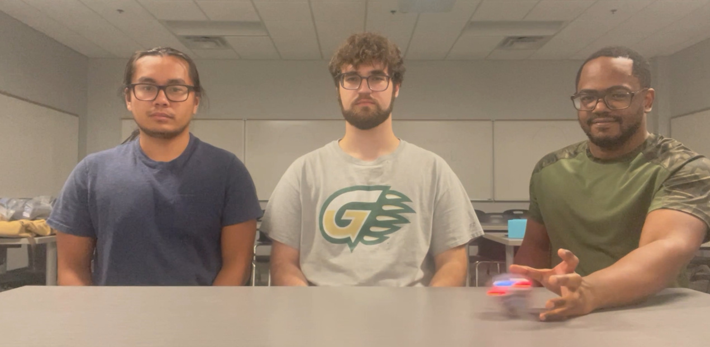
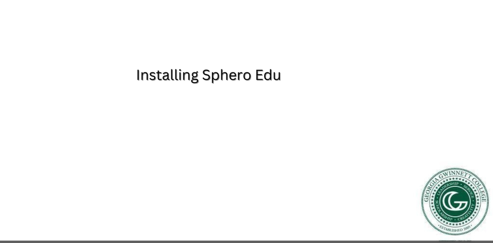
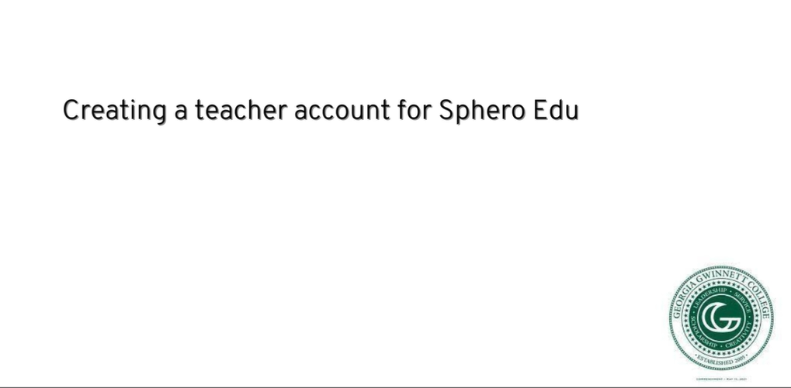
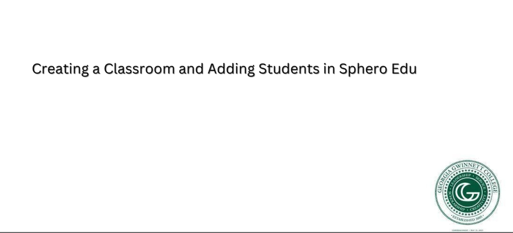
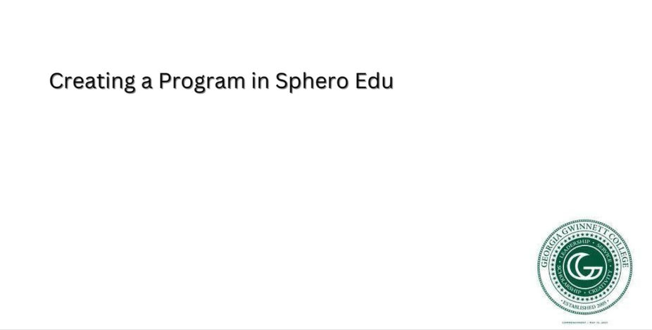
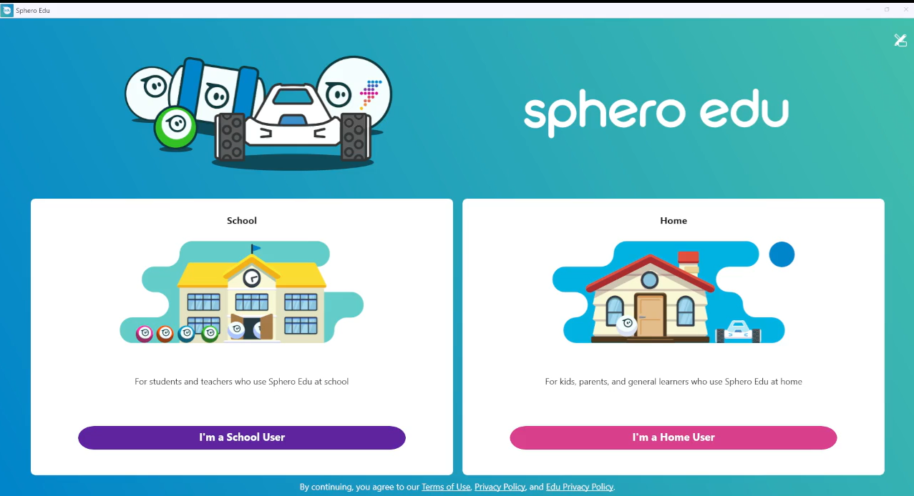

#  Teaching Algorithms and Growing STEM with Sphero
## Description
* Difficulty Level: Medium
* Target Audience: 6th Grade - College
* Duration of workshop: 60-90 minutes
* Needed Material: A classroom set of Spheros, Sphero EDU app,Sphero EDU website teacher account, a 36 in. x 48 in. foldable foam board, and a 36 in. x 48 in. plywood
* The primary goal of this project is educating others about algorithms by programming a robot through a maze using Sphero EDU. 
* Sphero is a small robot ball that moves around by either remote control or code you feed it. 
This workshop is geared towards educating and creating interest in the IT field for non STEM majors. 
By engaging in our workshops, students will get to experiment with Sphero.edu and block coding, which allows them to learn about algorithms through relatable examples. 
* The Technology Ambassador Program ([TAP](https://www.ggc.edu/academics/school-of-science-and-technology/research-internships-service-learning/technology-ambassador-program)) at GGC strives to break the misconceptions of the IT field by providing fun workshops for students of all backgrounds. TAP students design engaging and fun outreach workshops to encourage interest in IT and STEM.
### Commercial Video
Click the image below to watch a 30 second commercial for the project  

## Team
* Ammar Mehicevic
* Etienne Laccruche
* Tony Lam
### Advisors
* Dr. Cindy Robertson
* Dr. Anca Doloc-Mihu    
### Team Photo
  
(Left: Tony Lam, Middle: Ammar Mehicevic, Right: Etienne Laccruche)  

## Publications
1. Tony Lam, Ammar Mehicevic, Etienne Laccruche, Anca Doloc-Mihu, Cindy Robertson. Teaching Algorithms and Growing STEM with Sphero, Consortium for Computing
Sciences in Colleges: Southeastern Region (CCSC:SE), November 3-4, 2023, Conway, SC.
2. Tony Lam, Ammar Mehicevic, Etienne Laccruche, Anca Doloc-Mihu, Cindy Robertson. Teaching Algorithms and Growing STEM with Sphero, CREATE Symposium, November 30, 2023, Georgia Gwinnett College.

## Outreach Activities
1. Tap Expo, Oct 10, 2023, GGC – To promote IT field and the TAP program to college students
2. Super Saturday Series (S3), Nov 9, 2023, GGC – middle and high school girls to promote IT and
STEM career
3. Class Workshops – October 26th, November 13th, November 14th, 2023, GGC - promote IT field to non-IT college
students
## Similar Projects
### Sphero Projects
* [Ball Is Life](https://github.com/TAP-GGC/ball-is-life)
* [Dancing Sphero](https://github.com/TAP-GGC/DancingSphero)

### Cozmo Projects
* [Wanda](https://github.com/TAP-GGC/wanda)
* [TechGoldFish](https://github.com/TAP-GGC/TechGoldFish)

## Technology
Sphero is a robotic ball that can be programmed in the Sphero EDU app. The Sphero EDU app uses block coding similar to Scratch. 
|  |  |   |
| :-----------------------------------------------------------: | :-----------------------------------------------------------------------------------------------------------------: | :-------------------------------------------------------------: | 
| [Classroom set of Spheros](https://sphero.com/collections/all/products/sphero-bolt-power-pack) | [Sphero Robot](https://sphero.com/collections/all/products/sphero-bolt) | [Sphero EDU website](https://edu.sphero.com/sphero/home) |                                                                                 

## Project setup/Installation
### Installing Sphero EDU  
For instructions on how to install Sphero EDU please use the pdf file linked below.  

### Creating a Teacher Sphero Account 
For instructions on how to create a teacher sphero account please use the pdf file linked below.  

Video 

### Creating a Classroom and Adding Students in Sphero Edu
For instructions on how to create a classroom and add students please use the pdf file linked below.  

Video  

### Creating a Program in Sphero Edu
For instructions on how to create a program please use the pdf file linked below.  

Video 

### Construction
For instructions on how to build the maze please use the pdf file linked below.  

## Short demo instructions
Below is a link to a 5 minute video walkthrough of our workshop that anyone with a sphero can do.  

## Workshop Instructions

